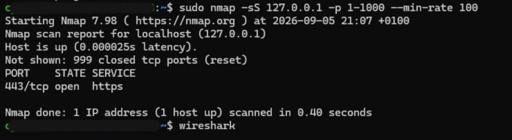
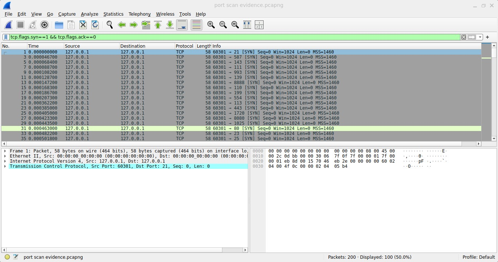
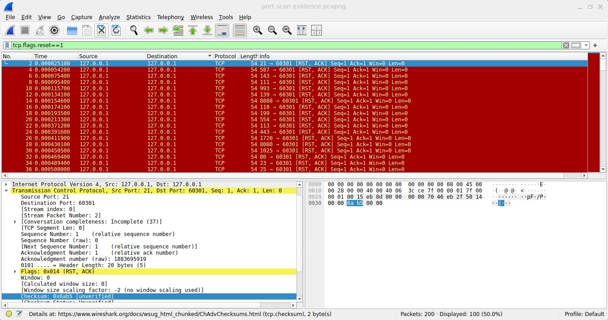
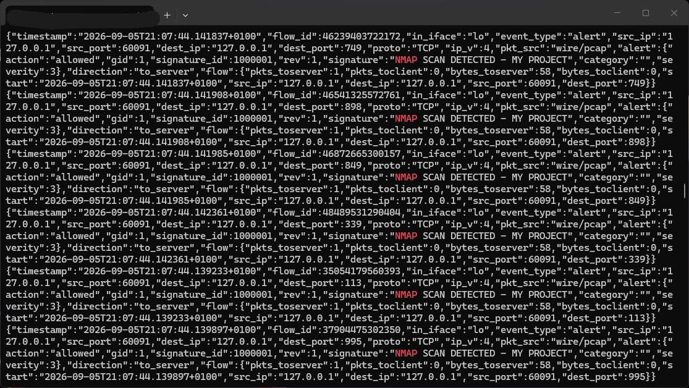

# port-scan-detection-wazuh-suricata
Nmap port scan detection lab using Ubuntu victim, suricata IDS and wazuh SIEM on WSL
Simulated SYN scan on single-laptop lab (loopback 127.0.0.1).
Pipeline:nmap > tcpdump > suricata (SID 1000001)>wazuh dashboard rule (86601)

## Proof
- tcpdump shows SYN/RST-ACK 
- eve.json logs signature_id 1000001
- suricata alerts displayed on wazuh live

## Files 
- rules/ - local.rules custom SIDs
- pcap/ - scan capture
- screenshots/ - nmap, even.json, wazuh

## Lab notes
used lo (127.0.0.1) due to single lab constraints. logic same as eth0 with two vms

linkedin post:https://lnkd.in/p/ezbJmvba
